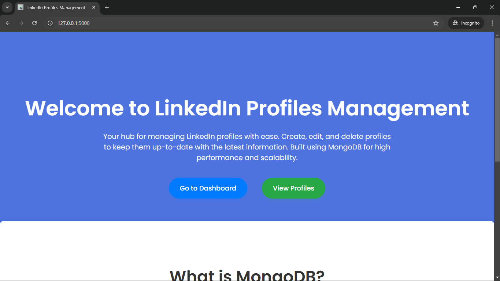
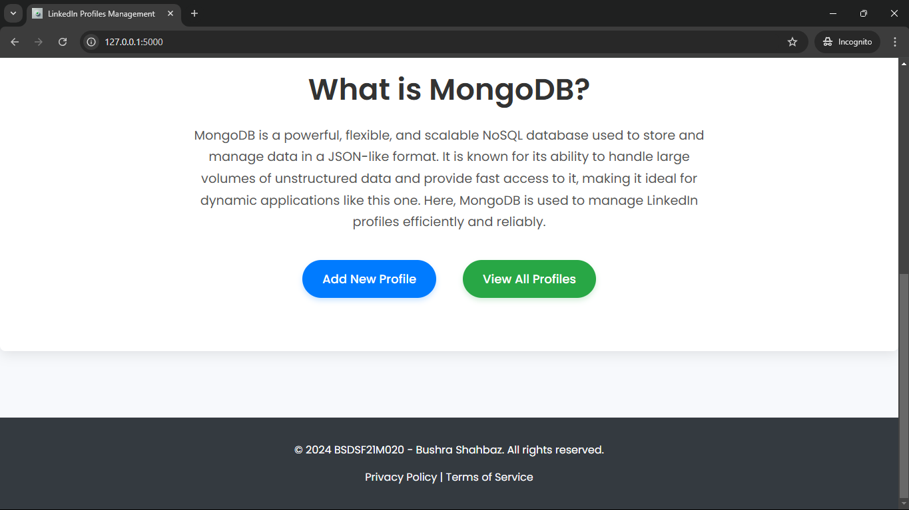
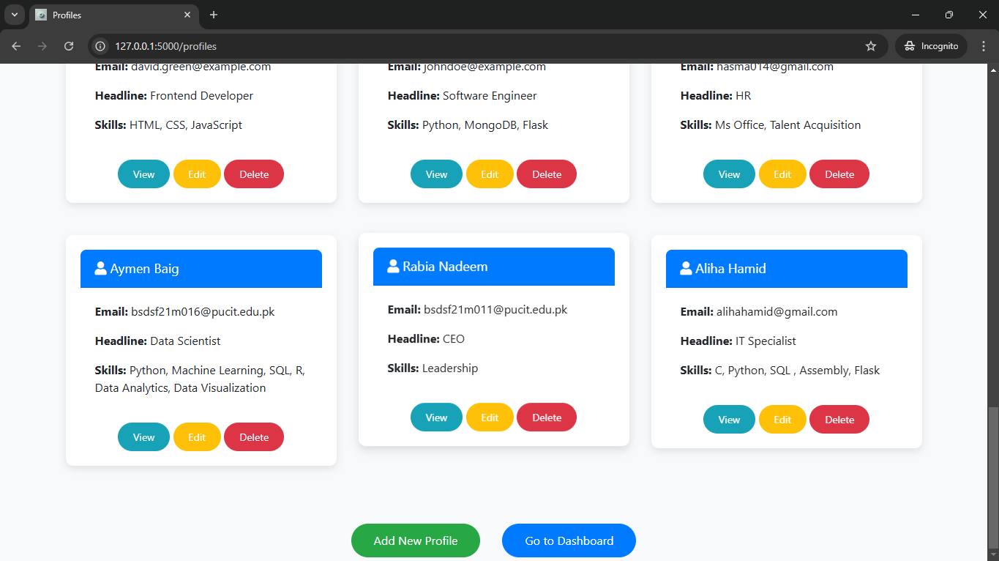
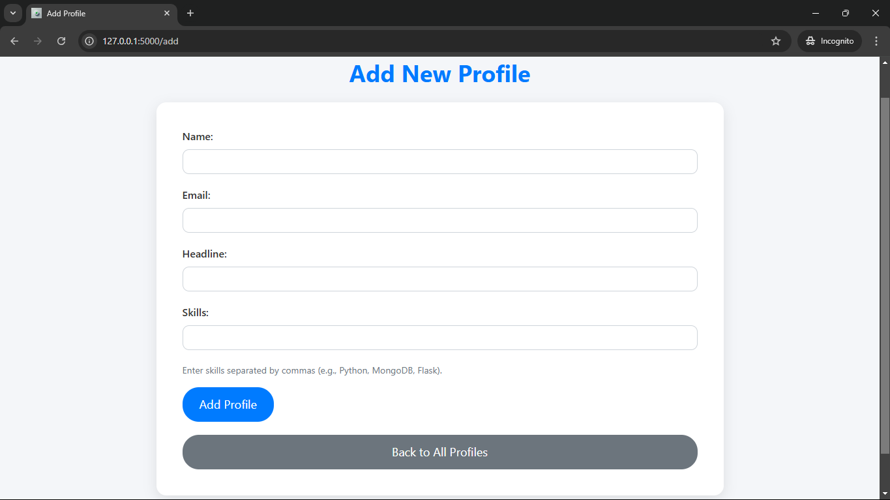
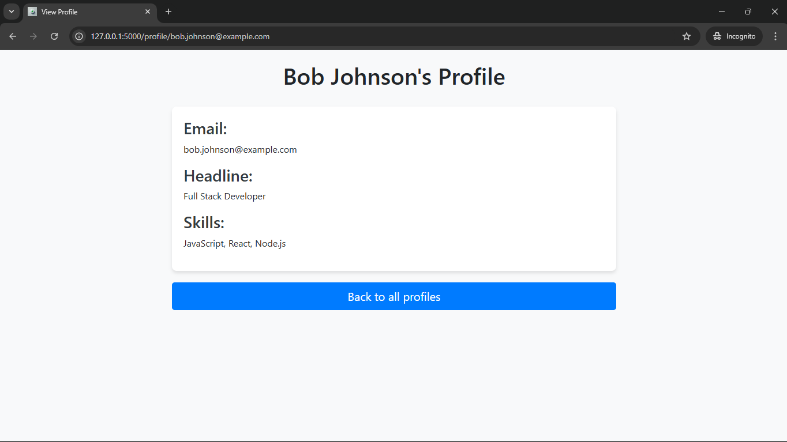
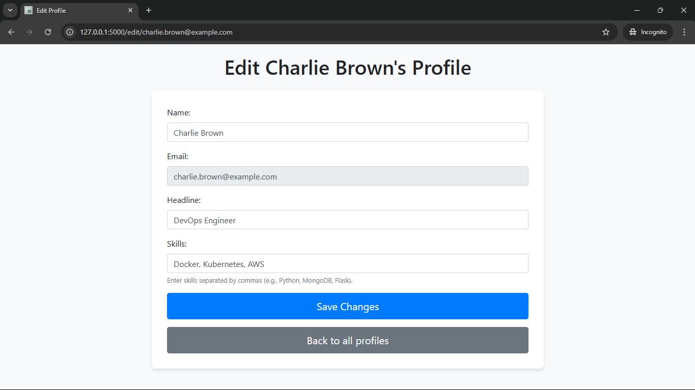
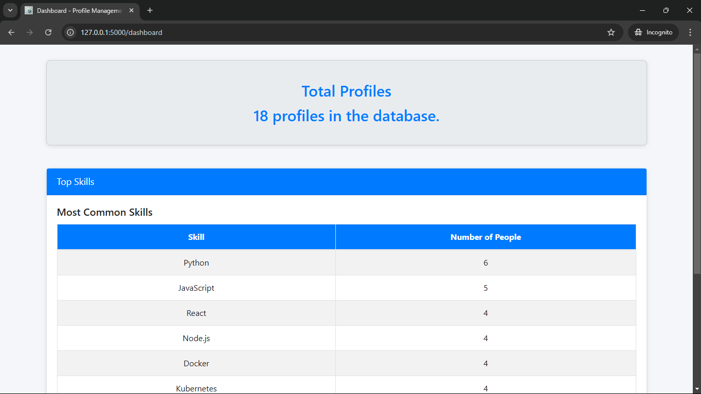

---

# **🌟 LinkedIn Profile Manager 🌟**

Welcome to the **LinkedIn Profile Management System**, a feature-rich web application for managing profiles efficiently. Whether you're looking to add, edit, or delete profiles, this app offers a sleek and professional interface powered by **Flask**, **MongoDB**, and **Bootstrap**.

---

## **📋 Features**
- 🌟 **User-Friendly Interface**: A responsive and clean UI to navigate profiles seamlessly.
- ➕ **Add Profiles**: Add detailed LinkedIn-style profiles with headline and skills.
- ✏️ **Edit Profiles**: Update existing profiles effortlessly.
- ❌ **Delete Profiles**: Remove profiles with a single click.
- 🔍 **View Profiles**: Showcase individual profiles with all details.
- 🛠️ **Dynamic Backend**: Fully integrated with MongoDB for real-time updates.
- 📈 **Scalable Design**: Built to handle a growing database with ease.

---

## **🚀 Getting Started**

### **Prerequisites**
- ✅ Python (3.7 or higher)
- ✅ Flask
- ✅ MongoDB (Local or Cloud Instance)
- ✅ Pip (Python package manager)

---

### **Installation**
1. Clone the repository:
   ```bash
   git clone https://github.com/Bushra-Butt-17/linked-profile-manager.git
   cd linked-profile-manager
   ```
2. Install required dependencies:
   ```bash
   pip install -r requirements.txt
   ```
3. Start MongoDB:
   - Run the MongoDB service locally or connect to a cloud instance (e.g., **MongoDB Atlas**).
4. Run the Flask server:
   ```bash
   flask run
   ```
5. Open the application in your browser:
   ```
   http://127.0.0.1:5000
   ```

---

## **📚 Technology Stack**

### **Frontend**
- **HTML5**: Structure and layout
- **CSS3 & Bootstrap**: Styling and responsive design
- **JavaScript**: Dynamic functionality

### **Backend**
- **Flask**: A lightweight Python framework for APIs
- **MongoDB**: A NoSQL database for flexible and scalable data storage

---

## **🛠️ API Endpoints Documentation**
## ✨ Endpoints Overview

### 1. **Home Page**
- **URL**: `/`
- **Method**: `GET`
- **Description**:  
  Displays a welcoming **Landing Page** introducing the app. It features navigation buttons to the Profiles and Dashboard sections.  
  

  

---

### 2. . View All Profiles
URL: /profiles
Method: GET
Description:
Fetches all profiles from the database and displays them in a card-based layout.
```
#### Screenshot:





---

### 3. **Add Profile**
- **URL**: `/add`
- **Methods**: `GET`, `POST`
- **Description**:  
  - **GET**: Displays a form for entering new profile details.  
  - **POST**: Accepts form data and adds the new profile to the MongoDB database.  

#### Example Payload:
```json
{
  "name": "Jane Doe",
  "email": "jane.doe@example.com",
  "headline": "Data Scientist",
  "skills": ["Python", "Machine Learning", "SQL"]
}
```
#### Screenshot:


---

### 4. **View Individual Profile**
- **URL**: `/profile/<email>`
- **Method**: `GET`
- **Description**:  
  Displays detailed information about a profile based on the email.  
  

---

### 5. **Edit Profile**
- **URL**: `/edit/<email>`
- **Methods**: `GET`, `POST`
- **Description**:  
  - **GET**: Displays a pre-filled form for editing profile details.  
  - **POST**: Updates the profile with new data provided in the form.  

#### Example Update:
```json
{
  "name": "Jane Doe",
  "email": "jane.doe@example.com",
  "headline": "Senior Data Scientist",
  "skills": ["Python", "Deep Learning", "SQL"]
}
```
#### Screenshot:


---

### 6. **Delete Profile**
- **URL**: `/delete/<email>`
- **Method**: `GET`
- **Description**:  
  Deletes the profile associated with the provided email. The page refreshes to display the remaining profiles.  

#### Example:
Request:
```bash
GET /delete/jane.doe@example.com
```
Response:
```json
{
  "message": "Profile deleted successfully."
}
```

---

### 7. **Dashboard**
- **URL**: `/dashboard`
- **Method**: `GET`
- **Description**:  
  Displays insights like the **total number of profiles** and the **most common skills** across all profiles.  
  


---


## **🗃️ Database Schema**

Profiles are stored in MongoDB in the following format:
```json
{
  "_id": "ObjectId",
  "name": "string",
  "email": "string",
  "headline": "string",
  "skills": ["string", "string", "string"]
}
```

---

## **🌟 Screenshots**

### Landing Page 🏠


### Profiles Dashboard 🗂️


### Add Profile Form ➕


### Edit Profile Form ✏️


---

## 🎥 Video Demonstration

https://github.com/user-attachments/assets/24b132a8-9c23-4b57-8bdb-40b68cbda8b1


https://github.com/user-attachments/assets/f570b78a-e5b6-4708-a773-3818417efed7

---

## **💡 What is MongoDB?**

MongoDB is a NoSQL, document-oriented database that stores data in **JSON-like documents** with optional schemas. It is highly flexible, scalable, and perfect for modern web applications.

### **Why MongoDB?**
- 💾 Stores unstructured data efficiently.
- 📈 Offers excellent scalability for growing datasets.
- 🔄 Allows dynamic schema updates without downtime.
- 🚀 Perfect for fast-paced development.

---

## **🤝 Contributing**
We welcome contributions! If you’d like to improve this project, feel free to:
1. Fork the repository.
2. Create a new branch.
3. Submit a pull request.

---

## **📝 Credits**

This project is created and maintained by **BSDSF21M020 - Bushra Shahbaz**.

---

## **📜 License**
This project is licensed under the MIT License. You are free to use, modify, and distribute it as you see fit.

---


